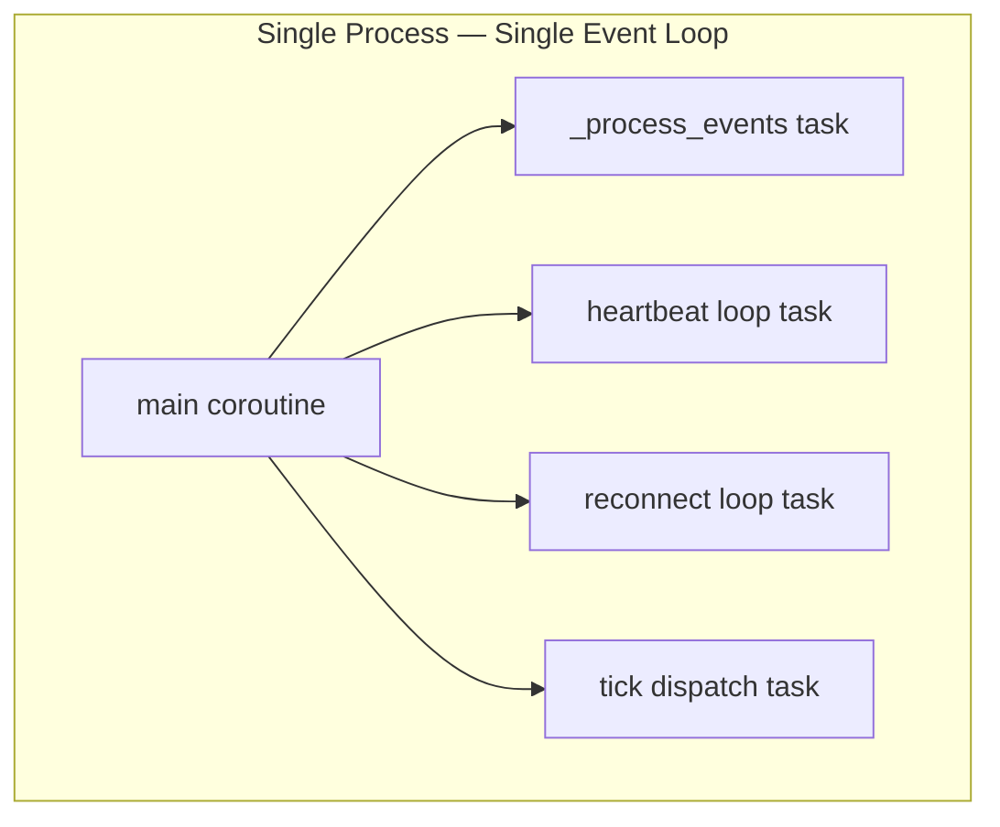
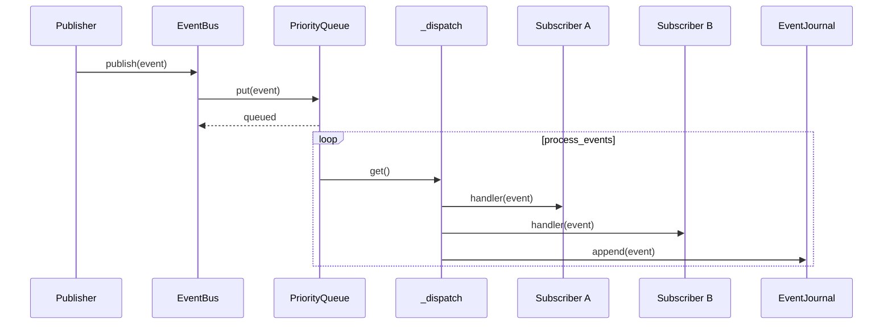
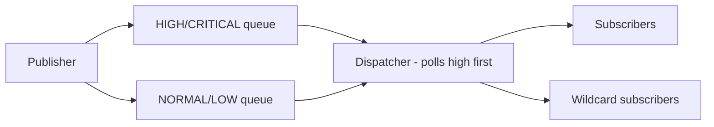
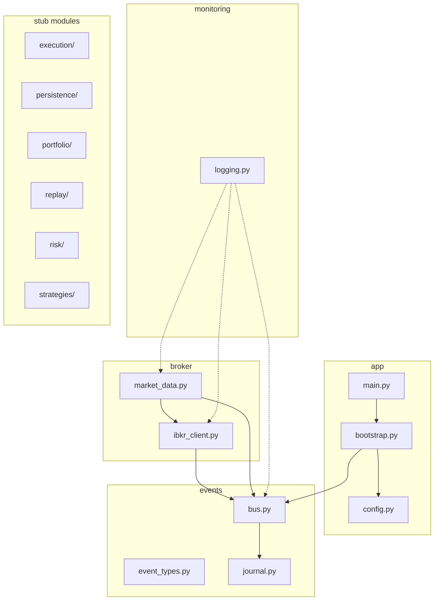

# System Architecture

## Architectural Style: Modular Monolith

The entire application runs in a single process, on a single machine, inside a single Python async event loop. Modules are logically separated but deployed together.

## Design Principles

- **Correctness over feature count** — deterministic behavior is paramount
- **Event-driven communication** — modules never directly manipulate each other's state
- **Immutable events** — all events are frozen dataclasses, the single source of truth
- **Broker encapsulation** — `ib_insync.IB` is private to `broker/`; domain events cross boundaries
- **Signal-only strategies** — strategies emit signals, never place orders or touch IBKR
- **Live/backtest parity** — same strategy code, same event flow; only data source and clock change

## Runtime Model

## Event Flow

## Priority Routing

## Module Architecture

## Key Architectural Constraints

1. **IBKR types must NOT leak outside `broker/`** — `ib_insync.IB` is typed as `Any` in broker module, `IB()` constructor has `# type: ignore[no-untyped-call]`
2. **Strategies emit signals only** — they never place orders, call IBKR, or manage positions
3. **Same code path for live and backtest** — only the data source/clock changes
4. **All critical state transitions occur through events** — events are the single source of truth
5. **Modules communicate via EventBus** — no direct imports between domain modules
