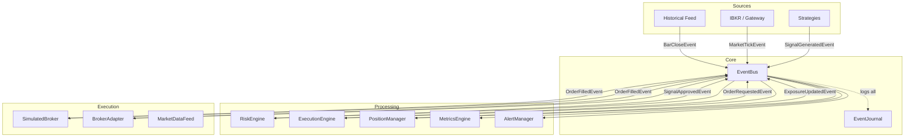
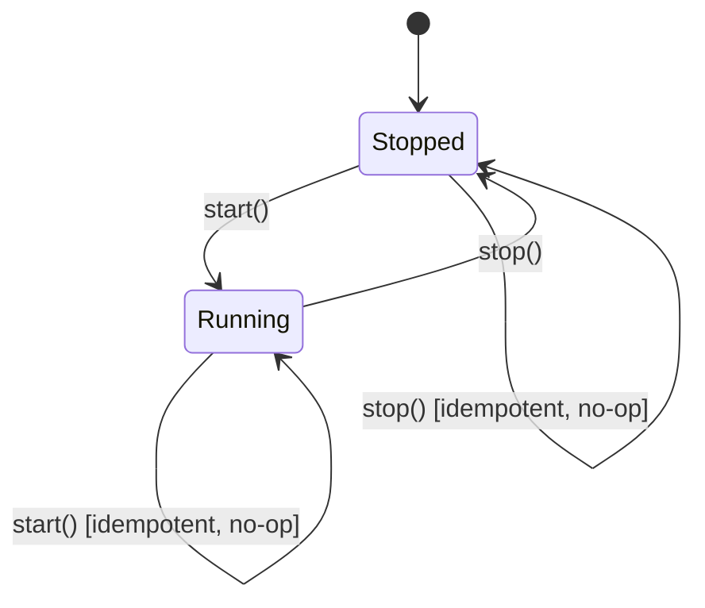
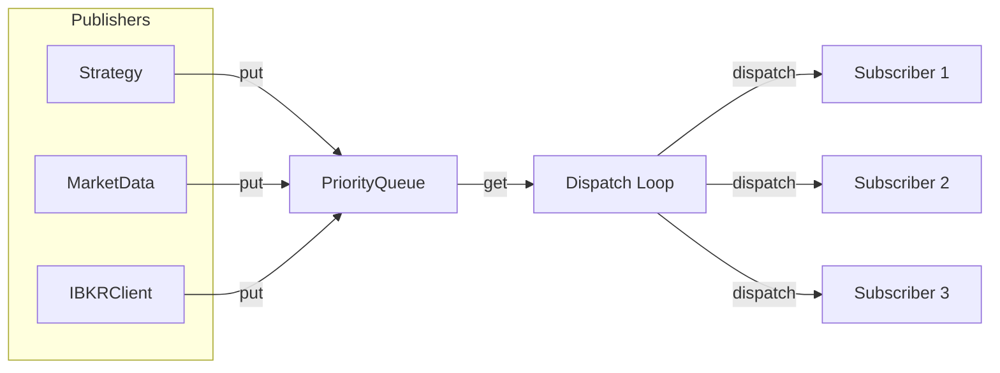
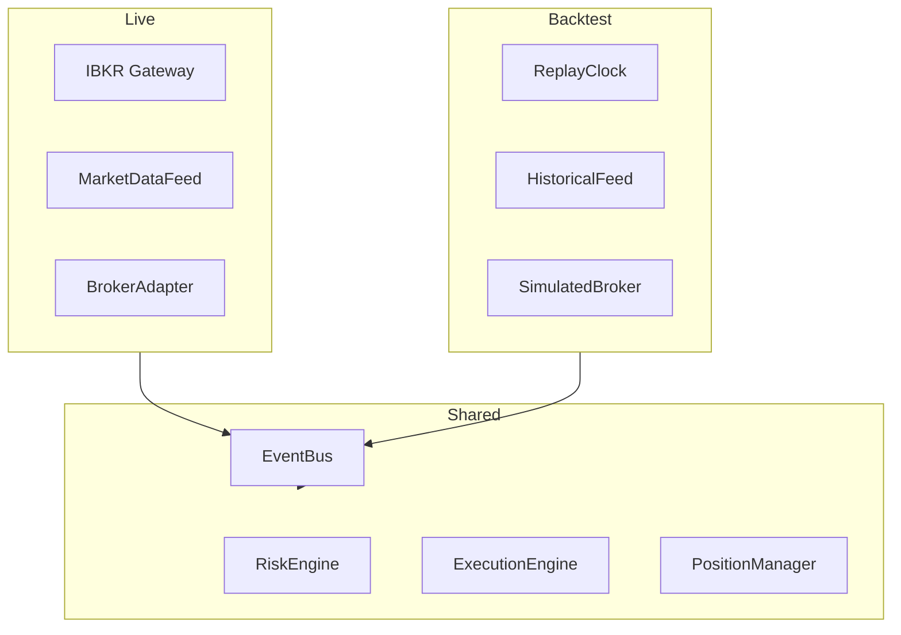
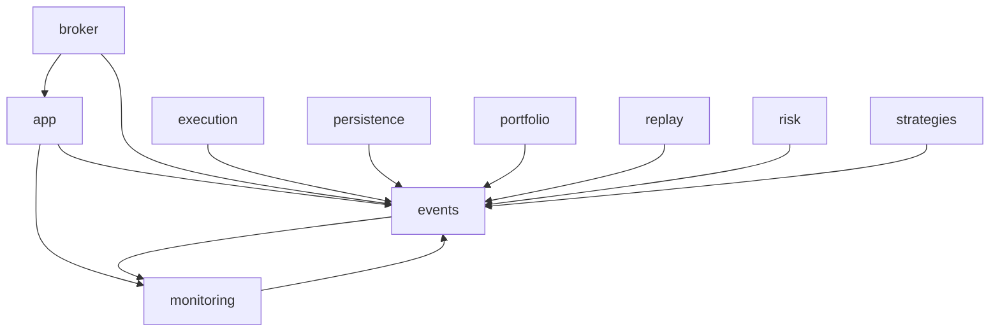

# Architecture

## Overview
The trading platform is an **event-driven modular monolith** — a single process with a single asyncio event loop where all communication between modules flows through typed domain events on a central `EventBus`.

## Key Design Decisions

### Event-Driven Architecture
- `EventBus` is the central nervous system — a typed async pub/sub with dual priority queues (HIGH/CRITICAL vs NORMAL/LOW)
- All components subscribe to specific event types and publish events
- No direct method calls between business modules (except `broker/` internals)
- EventJournal provides SQLite append-only persistence for replay/audit

### Component Lifecycle
Every component follows a consistent lifecycle pattern:

Each component:
- Has a boolean `is_running` property
- Subscribes to events on `start()` and returns unsubscribe callables
- Unsubscribes on `stop()`
- Ignores events received when `_running` is False

### Event Bus Architecture

- `PriorityQueue` wraps two `asyncio.Queue` instances (high/normal)
- Dispatch loop runs in a single `asyncio.Task`, draining events sequentially
- Errors in handlers don't crash the bus — they're logged and optionally passed to an error handler
- `drain()` awaits both queues to be empty (for test synchronization)

### IBKR Isolation Boundary
- `ib_insync` types (`IB`, `Contract`, `Ticker`, `Trade`) are typed as `Any` and never appear outside `broker/`
- All cross-module communication uses domain events defined in `events/event_types.py`
- The `broker/` module has three components:
  - `IBKRClient` — connection lifecycle, heartbeat, reconnection
  - `MarketDataFeed` — tick subscriptions, bar aggregation
  - `BrokerAdapter` — order placement, status tracking, fill handling

### Live vs Backtest Parity
- Same code path executes both live and in backtest
- Live: `IBKRClient` + `MarketDataFeed` + `BrokerAdapter` (real IBKR)
- Backtest: `ReplayClock` + `HistoricalFeed` + `SimulatedBroker` (simulated)
- All downstream components (`RiskEngine`, `ExecutionEngine`, `PositionManager`, etc.) remain identical

## Module Dependency Graph

Note: All modules depend on `events/` (for event types and bus) and `monitoring/` (for logging). The `app/` module wires everything together at startup.
