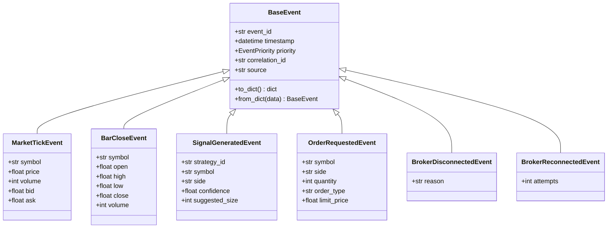
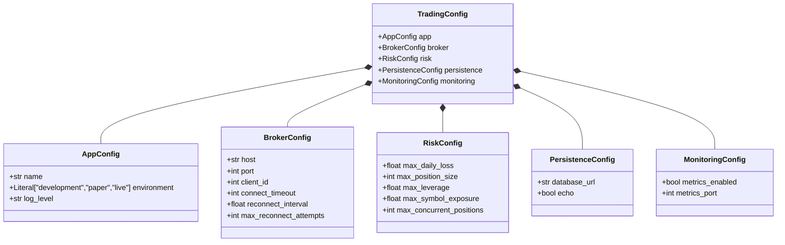

# Data Models

## BaseEvent Hierarchy

## All 25 Event Types

| Event | Fields (beyond BaseEvent) |
|---|---|
| MarketTickEvent | symbol, price, volume, bid, ask |
| BarCloseEvent | symbol, open, high, low, close, volume |
| MarketOpenEvent | symbol |
| MarketCloseEvent | symbol |
| SignalGeneratedEvent | strategy_id, symbol, side, confidence, suggested_size |
| SignalRejectedEvent | strategy_id, symbol, reason |
| StrategyErrorEvent | strategy_id, error |
| RiskViolationEvent | strategy_id, rule, reason |
| TradingHaltedEvent | reason |
| ExposureLimitEvent | current_exposure, limit |
| OrderRequestedEvent | symbol, side, quantity, order_type, limit_price |
| OrderSubmittedEvent | order_id, symbol, side, quantity, order_type, limit_price |
| OrderFilledEvent | order_id, symbol, side, fill_price, fill_quantity |
| OrderCancelledEvent | order_id, reason |
| OrderStatusChangedEvent | order_id, status |
| PositionOpenedEvent | symbol, quantity, avg_cost |
| PositionClosedEvent | symbol, realized_pnl |
| PnLUpdatedEvent | symbol, unrealized_pnl, realized_pnl |
| AccountSummaryUpdate | cash, buying_power, gross_position_value, net_liquidation |
| PositionUpdate | symbol, position, avg_cost, market_price |
| BrokerDisconnectedEvent | reason |
| BrokerReconnectedEvent | attempts |
| HeartbeatEvent | (none) |

## EventPriority Enum

| Priority | Queue Route |
|---|---|
| LOW | Normal queue |
| NORMAL | Normal queue |
| HIGH | High-priority queue (drained first) |
| CRITICAL | High-priority queue (drained first) |

## Config Models (pydantic BaseModel)

## SQLAlchemy Model: EventRecord

| Column | Type | Constraints |
|---|---|---|
| id | Integer | PK, autoincrement |
| sequence | Integer | NOT NULL |
| event_type | String(128) | NOT NULL |
| event_id | String(64) | NOT NULL, indexed |
| timestamp | DateTime(tz) | NOT NULL |
| payload | Text | NOT NULL (JSON) |
| recorded_at | DateTime(tz) | NOT NULL |

## BarAggregator Internal State

| Field | Type | Description |
|---|---|---|
| symbol | str | Symbol being aggregated |
| bar_size_seconds | float | Time window per bar |
| bar_start | datetime | When current bar started |
| open/high/low/close | float | OHLCV accumulators |
| volume | int | Accumulated volume |

## MarketDataFeed Internal State

| Field | Type | Description |
|---|---|---|
| _subscriptions | dict[str, Contract] | Symbol → ib_insync Contract |
| _aggs | dict[str, BarAggregator] | Symbol → bar aggregator |
| _handler_id | str | pendingTickersEvent handler ID |
| _running | bool | Feed active flag |
