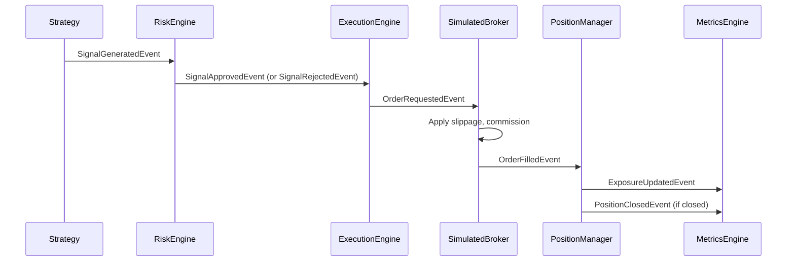

# Interfaces & Integration Points

## Event Contracts

All inter-module communication uses typed domain events. Below is the complete event catalog with publishers and subscribers.

### Market Data Events

| Event | Publisher(s) | Fields | Subscribers |
|---|---|---|---|
| `MarketTickEvent` | `MarketDataFeed` | symbol, price, volume, bid, ask | `PositionManager`, `ExecutionEngine`, `RiskEngine`, `SimulatedBroker` |
| `BarCloseEvent` | `MarketDataFeed`, `HistoricalFeed` | symbol, open, high, low, close, volume | `SimulatedBroker`, Strategies |
| `MarketOpenEvent` | `MarketDataFeed` | symbol | — |
| `MarketCloseEvent` | `MarketDataFeed` | symbol | — |

### Signal Events

| Event | Publisher(s) | Fields | Subscribers |
|---|---|---|---|
| `SignalGeneratedEvent` | Strategies | strategy_id, symbol, side, confidence, suggested_size | `RiskEngine` |
| `SignalApprovedEvent` | `RiskEngine` | strategy_id, symbol, side, confidence, suggested_size | `ExecutionEngine` |
| `SignalRejectedEvent` | `RiskEngine` | strategy_id, symbol, reason | `AlertManager` |
| `StrategyErrorEvent` | Strategies | strategy_id, error | — |

### Order Events

| Event | Publisher(s) | Fields | Subscribers |
|---|---|---|---|
| `OrderRequestedEvent` | `ExecutionEngine` | symbol, side, quantity, order_type, limit_price | `SimulatedBroker`, `BrokerAdapter` |
| `OrderSubmittedEvent` | `SimulatedBroker`, `BrokerAdapter`, `ExecutionEngine` | order_id, symbol, side, quantity, order_type, limit_price | `ExecutionEngine` |
| `OrderFilledEvent` | `SimulatedBroker`, `BrokerAdapter` | order_id, symbol, side, fill_price, fill_quantity | `PositionManager`, `RiskEngine`, `MetricsEngine`, `ExecutionEngine` |
| `OrderCancelledEvent` | `BrokerAdapter` | order_id, reason | — |
| `OrderStatusChangedEvent` | `SimulatedBroker`, `BrokerAdapter` | order_id, status | — |

### Position/Portfolio Events

| Event | Publisher(s) | Fields | Subscribers |
|---|---|---|---|
| `PositionOpenedEvent` | `PositionManager` | symbol, quantity, avg_cost | `MetricsEngine` |
| `PositionClosedEvent` | `PositionManager` | symbol, realized_pnl | `MetricsEngine` |
| `PnLUpdatedEvent` | `PositionManager` | symbol, unrealized_pnl, realized_pnl | — |
| `PositionUpdate` | `PositionManager` | symbol, position, avg_cost, market_price | — |
| `ExposureUpdatedEvent` | `PositionManager` | gross_exposure, net_exposure, leverage, long_count, short_count, equity | `RiskEngine`, `MetricsEngine` |
| `ExposureLimitEvent` | `PositionManager` | current_exposure, limit | — |
| `AccountSummaryUpdate` | — | cash, buying_power, gross_position_value, net_liquidation | — |

### Risk Events

| Event | Publisher(s) | Fields | Subscribers |
|---|---|---|---|
| `RiskViolationEvent` | `RiskEngine` | strategy_id, rule, reason | `AlertManager` |
| `TradingHaltedEvent` | `RiskEngine` | reason | `AlertManager` |

### Connection Events

| Event | Publisher(s) | Fields | Subscribers |
|---|---|---|---|
| `BrokerDisconnectedEvent` | `IBKRClient` | reason | `RiskEngine`, `AlertManager` |
| `BrokerReconnectedEvent` | `IBKRClient` | attempts | `MarketDataFeed`, `AlertManager` |
| `HeartbeatEvent` | `IBKRClient` | (none) | `AlertManager` |

### Monitoring Events

| Event | Publisher(s) | Fields | Subscribers |
|---|---|---|---|
| `AlertEvent` | `AlertManager` | alert_type, message, severity | — |

## Main Event Flow (Signal → Fill)



## BC Boundaries

```
┌─────────────────────────────────────────────────────┐
│                    broker/                           │
│  IBKRClient | MarketDataFeed | BrokerAdapter        │
│  (ib_insync types: IB, Contract, Ticker, Trade)     │
└────────┬────────────────────────────────────────────┘
         │ Only domain events cross this boundary
         ▼
┌─────────────────────────────────────────────────────┐
│              All other modules                       │
│  No ib_insync imports allowed                       │
│  Communication via EventBus only                   │
└─────────────────────────────────────────────────────┘
```

## Component Registration Pattern

Every subscribable component follows this pattern for event subscriptions:

```python
async def start(self) -> None:
    self._running = True
    self._some_unsub = await self._subscribe_some_event()

async def stop(self) -> None:
    self._running = False
    if self._some_unsub is not None:
        self._some_unsub()
        self._some_unsub = None

async def _subscribe_some_event(self) -> Any:
    async def handler(event: BaseEvent) -> None:
        await self._on_some_event(event)
    self._event_bus.subscribe(SomeEvent, handler, name="component_name")
    return lambda: self._event_bus.unsubscribe(SomeEvent, handler)
```

Each subscription returns an unsubscribe callable stored as `Any` (since callable signatures are complex).
