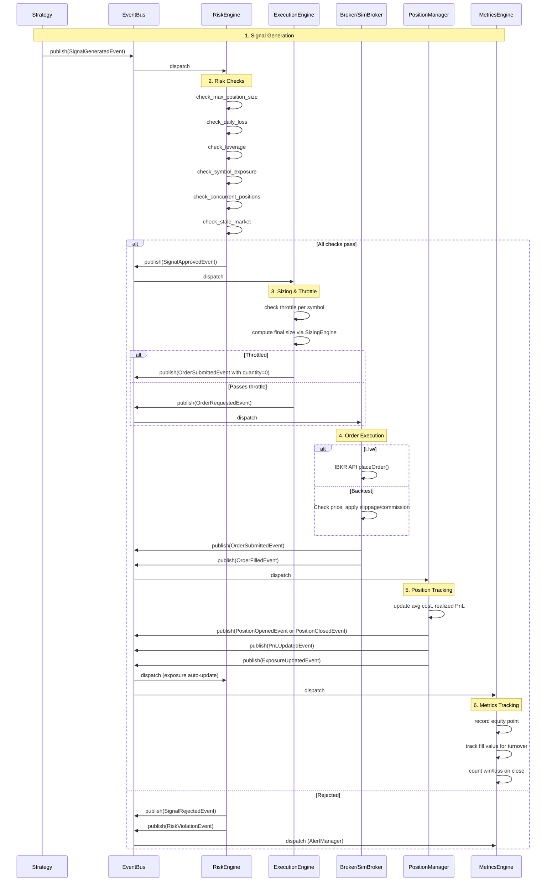
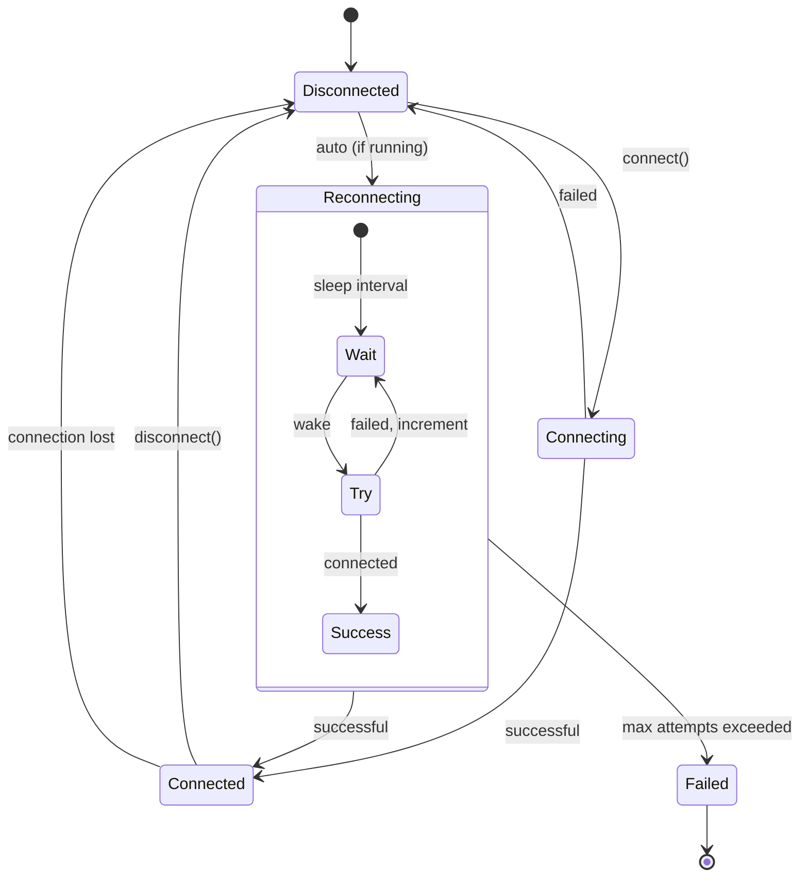
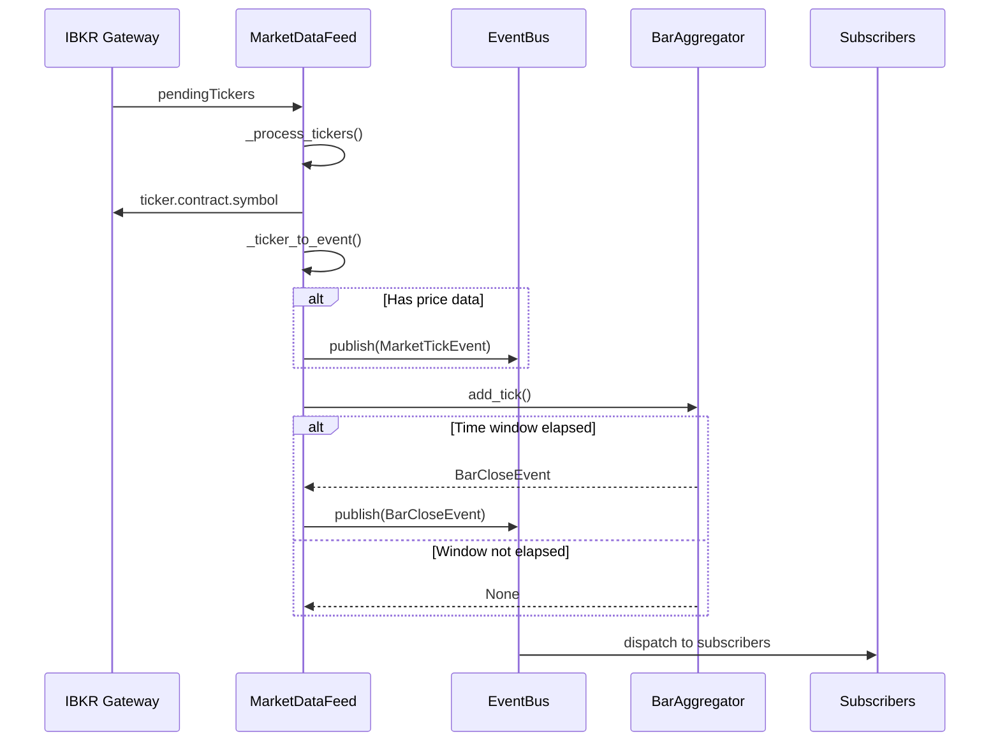
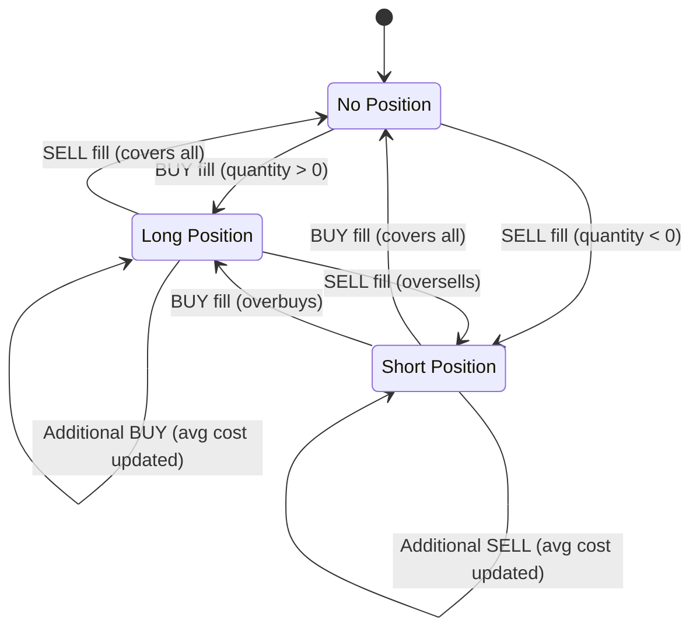
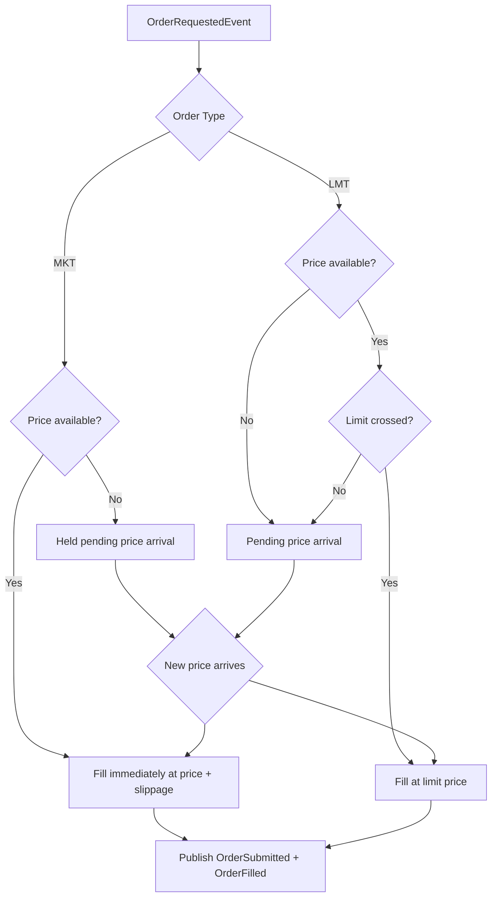
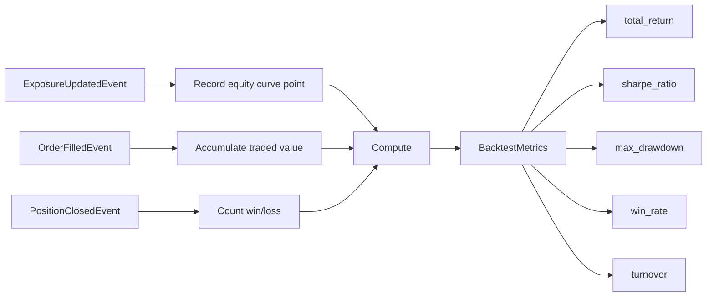
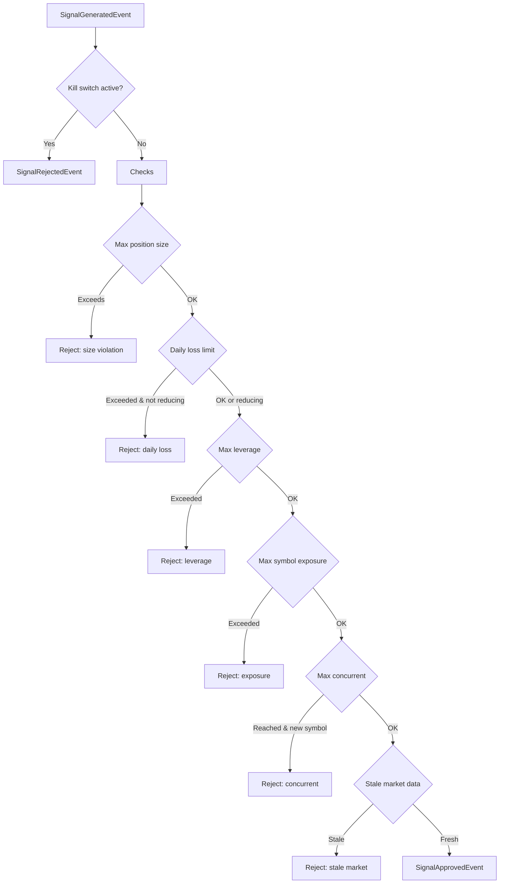
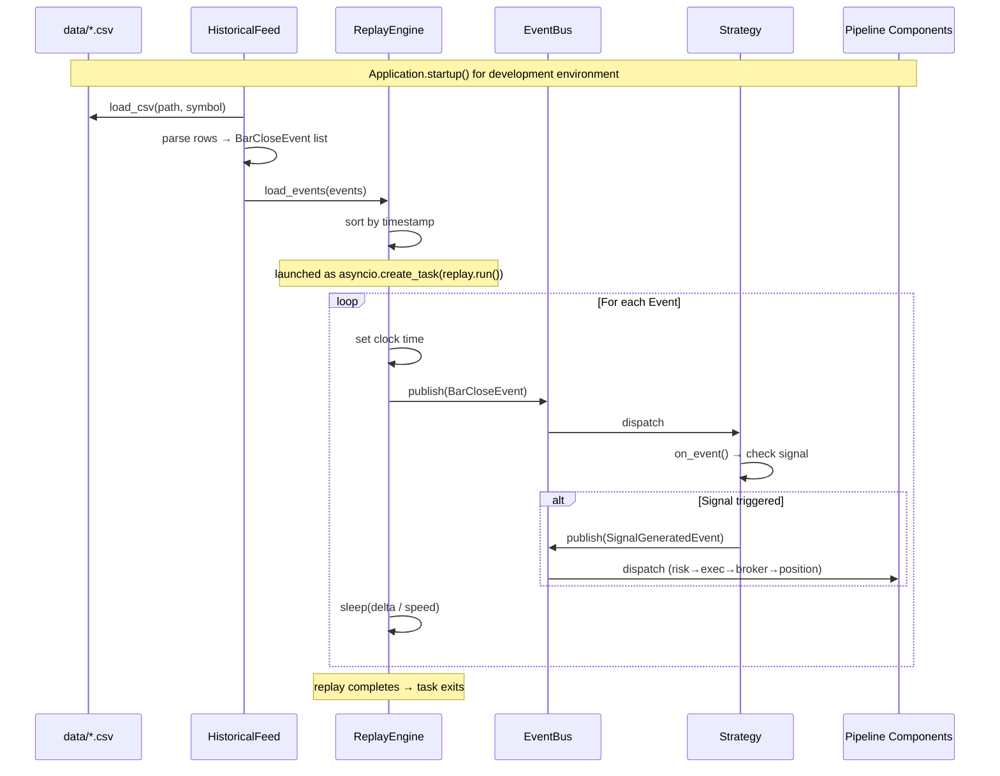
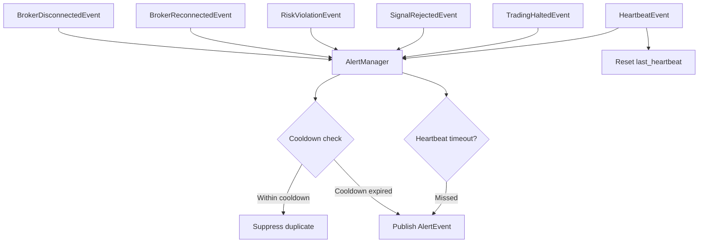

# Workflows

## 1. Signal-to-Fill Pipeline (Core Trading Flow)

## 2. Connection Lifecycle & Reconnection

1. `IBKRClient.connect()` opens IBKR Gateway connection
2. Publishes `BrokerReconnectedEvent` on success
3. Sets up `disconnectedEvent` handler and starts heartbeat loop
4. On disconnect, publishes `BrokerDisconnectedEvent` → triggers kill switch in `RiskEngine`
5. Reconnect loop retries with configurable interval and max attempts
6. On reconnect success, publishes `BrokerReconnectedEvent` → triggers `MarketDataFeed` re-subscription
7. `AlertManager` monitors disconnect/reconnect events and heartbeat health

## 3. Market Data Flow (Live)

- Tick-triggered bar aggregation: bar emitted when new tick arrives AFTER the time window has elapsed
- Price data is the primary source; bid/ask used as fallback when last price is 0

## 4. Position Management Flow

### Position Update Rules
- **BUY when long/neutral:** Increases quantity, recalculates avg cost (weighted average)
- **SELL when short/neutral:** Increases short quantity, recalculates avg cost
- **BUY when short (covering):** Realizes PnL on covered shares, may flip to long
- **SELL when long (reducing):** Realizes PnL on reduced shares, may flip to short

## 5. Order Execution (Simulated)

## 6. Backtest Metrics Computation

Metrics are computed lazily via `MetricsEngine.compute()`:
1. **Total Return**: `(end_eq - start_eq) / start_eq`
2. **Annualized Return**: `(1 + total_return)^(1/years) - 1`
3. **Sharpe Ratio**: Annualized excess return / annualized std dev of simple returns
4. **Max Drawdown**: Maximum peak-to-trough decline as percentage
5. **Win Rate**: Winning trades / total trades (zero PnL not counted)
6. **Turnover**: Total traded value / average equity

## 7. Risk Engine Checks

## 8. Development Mode Data Flow (ReplayEngine)

- Only runs in `development` environment (skipped for `paper`/`live`)
- Reads CSV files from `data/` directory (filename = symbol, e.g. `AAPL.csv`)
- `HistoricalFeed` handles column mapping, date filtering, and malformed row skipping
- `ReplayEngine` publishes events at clock-adjusted cadence (real-time at speed=1)
- Same downstream pipeline processes events regardless of source (live or replay)

## 9. Monitoring Alert Flow

- Cooldown per `alert_type` string key (e.g., `broker_disconnected`, `risk_violation_*`)
- Heartbeat check runs at `heartbeat_timeout / 2` frequency
- If no heartbeat within timeout, publishes `AlertEvent` with severity `ERROR`
