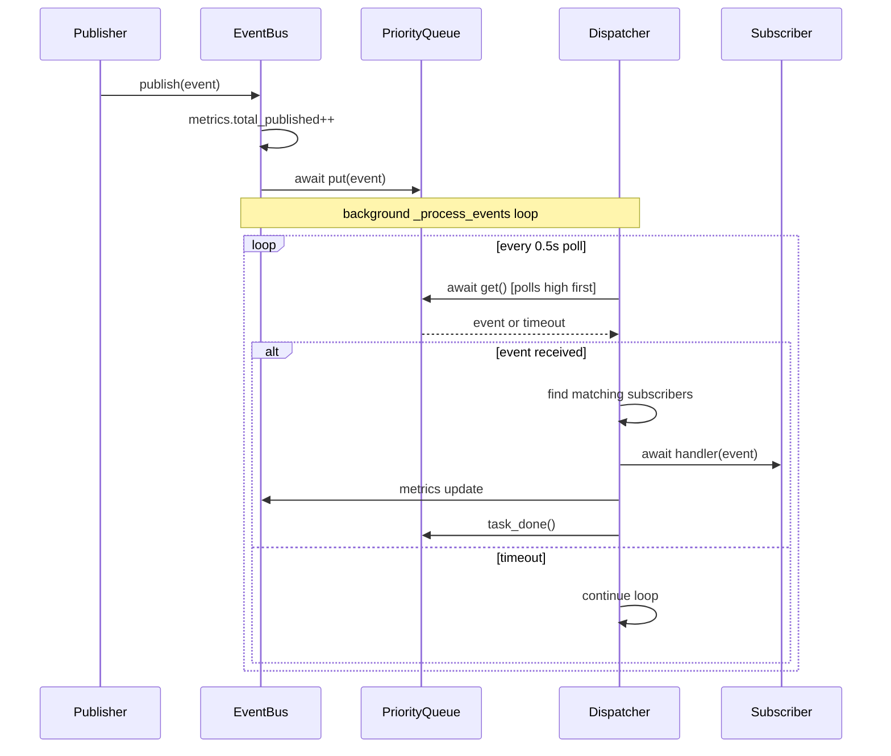
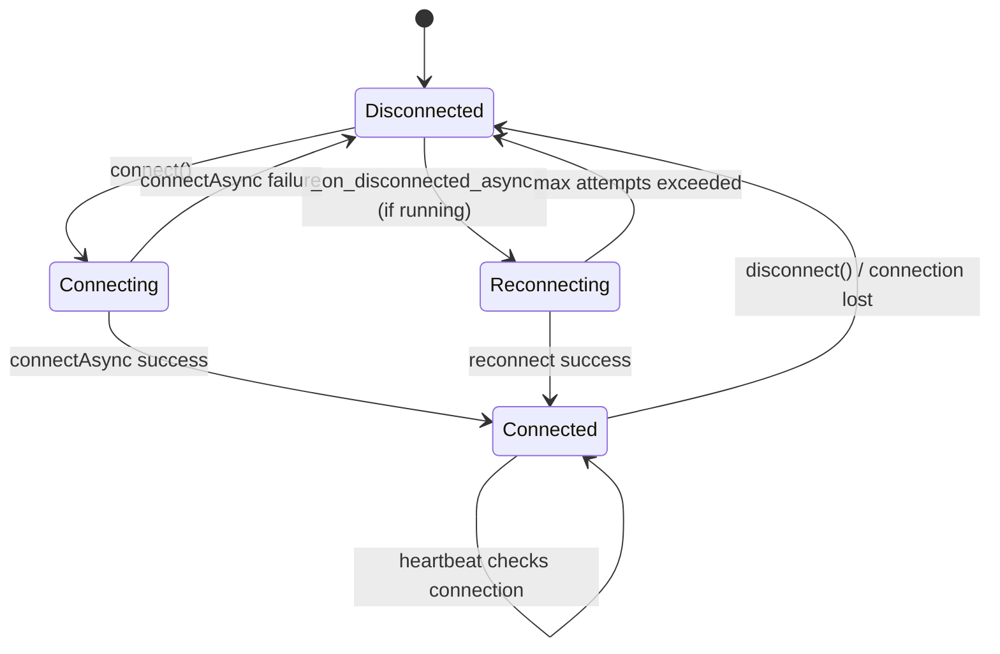
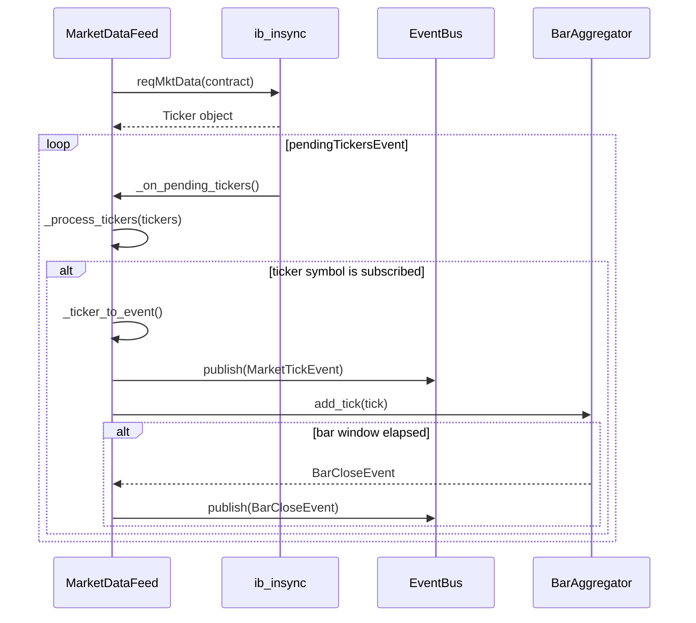
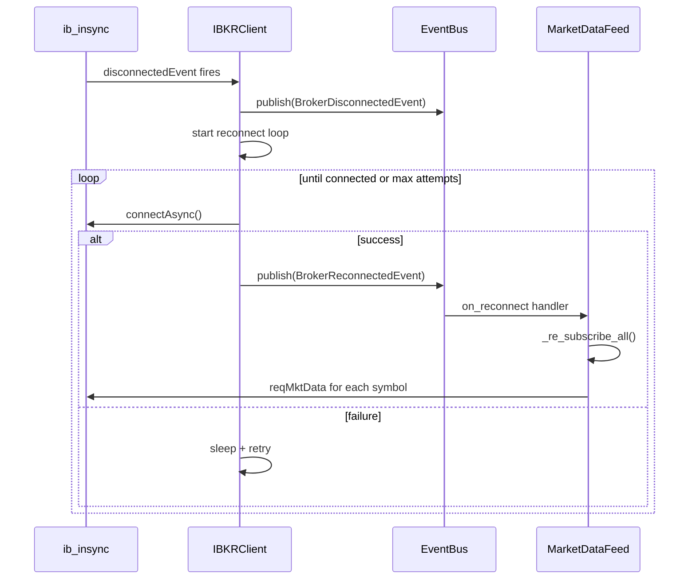
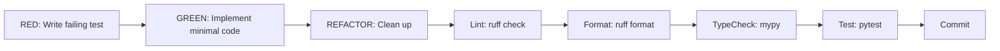

# Key Workflows

## Event Publication and Dispatch

## IBKR Connection Lifecycle

## Market Data Flow

## Reconnection and Re-subscription

## Test-Driven Development Cycle

## Commit Conventions

| Pattern | Example |
|---|---|
| `Phase X.Y: description` | `Phase 2.2: market data feed with tick subscriptions and bar aggregation` |
| `docs: description` | `docs: add AGENTS.md with commands, architecture, conventions` |

Full workflow: `ruff check && ruff format . && mypy src/ && pytest`
