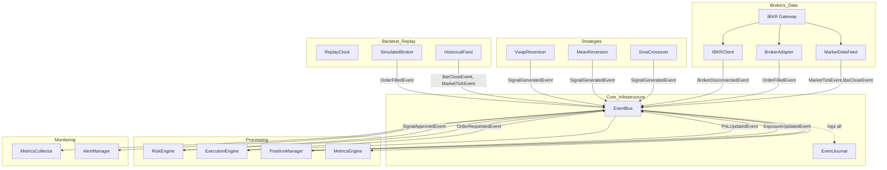

# AGENTS.md

## Commands

```sh
poetry run pytest                              # All 434 tests
poetry run ruff check .                         # Lint (0 errors expected)
poetry run ruff check --fix .                   # Lint + fix
poetry run ruff format .                        # Format (line-length 100, double quotes)
poetry run mypy src/                            # Strict typecheck (1 known yaml-stubs error)
poetry run pre-commit run --all-files           # All hooks
poetry run python scripts/backtest.py <csv>                   # Bar backtest
poetry run python scripts/backtest.py <csv> --tick             # Tick backtest
poetry run python scripts/backtest.py <csv> --journal --verbose  # With journal + debug
poetry run python scripts/loadtest.py <csv>                    # Loadtest profiler
poetry run python -m edrader.app.main           # Run live (needs IB Gateway)
```

Order: `ruff check -> ruff format -> mypy -> pytest`.

## Architecture Overview



## Directory Structure & Key Entry Points

```
src/edrader/
├── app/           # bootstrap.py (Application lifecycle), config.py (pydantic), main.py
├── broker/        # ibkr_client.py (IBKR connection), market_data.py (ticks+bars),
│                  # order_management.py (BrokerAdapter), __init__.py (task_error_logger)
├── events/        # event_types.py (26 domain events + EventPriority enum),
│                  # bus.py (EventBus with PriorityQueue + sync_mode),
│                  # journal.py (EventJournal with batch writes)
├── execution/     # engine.py (ExecutionEngine), sizing.py (SizingEngine)
├── monitoring/    # logging.py (structlog), metrics.py (MetricsCollector), alerts.py (AlertManager)
├── persistence/   # database.py (DatabaseManager), models.py (4 ORM tables)
├── portfolio/     # position.py (PositionManager, Position, ExposureSnapshot)
├── replay/        # clock.py, engine.py, historical_feed.py, simulated_broker.py,
│                  # metrics.py (MetricsEngine, BacktestMetrics)
├── risk/          # engine.py (RiskEngine: 6 checks + kill switch)
└── strategies/    # base.py (Strategy ABC, StrategyLoader),
                   # examples/ (sma_crossover, mean_reversion, vwap_reversion)

scripts/
├── backtest.py    # End-to-end backtest runner (--tick, --journal, --verbose flags)
└── loadtest.py    # Step-by-step subscriber-scaling latency profiler

tests/  # 22 test files, 434 tests, pytest-asyncio with asyncio_mode=auto
```

## Implementation Status

All 10 phases complete (P0–P10). 434 tests across 22 files.

## Architecture Principles

- **Modular monolith**, single process, single asyncio event loop
- **Events as single source of truth** — 26 frozen dataclass event types (slots=True), `to_dict()`/`from_dict()` serialization, `EventPriority` (LOW/NORMAL/HIGH/CRITICAL)
- **`EventBus`** — dual `asyncio.Queue` (high+critical vs normal+low), `sync_mode` property for backtest (synchronous dispatch), handler cache for O(1) dispatch lookup, `subscriber_timeout` (5s default)
- **`EventJournal`** — SQLite append-only event store with batch writes, raw SQL `executemany`, `fast_mode` pragmas
- **IBKR types MUST NOT leak outside `broker/`** — `ib_insync.IB` typed as `Any`, all cross-module communication uses domain events
- **Strategies emit signals only** — abstract `on_event()` method, `emit_signal()` helper; never place orders, call IBKR, or manage positions
- **Same code path for live and backtest** — only data source (MarketDataFeed vs HistoricalFeed), clock, and broker (BrokerAdapter vs SimulatedBroker) differ
- **All components lifecycle-managed** — `start()`/`stop()` with idempotency guards, unsubscribe callables tracked and cleared on stop

## Event Flow (Signal → Fill)

```
Strategy.on_event(BarCloseEvent/MarketTickEvent)
  → emit_signal(symbol, side, confidence, suggested_size)
  → publish(SignalGeneratedEvent)

RiskEngine subscriber:
  → 6 checks (max_position_size, daily_loss, leverage, symbol_exposure,
              concurrent_positions, stale_market)
  → kill_switch blocks all signals
  → publish(SignalApprovedEvent) or SignalRejectedEvent + RiskViolationEvent

ExecutionEngine subscriber:
  → throttle check (per-symbol cooldown)
  → SizingEngine.compute_size() → final quantity
  → publish(OrderRequestedEvent)

SimulatedBroker subscriber:
  → create order, fill at current price (or hold for next bar/tick)
  → publish OrderSubmittedEvent → OrderStatusChangedEvent → OrderFilledEvent
  → 3 events per fill

PositionManager subscriber:
  → update position (avg_cost, realized_pnl via weighted average)
  → publish PositionOpenedEvent / PositionClosedEvent / PnLUpdatedEvent / PositionUpdate
  → publish ExposureUpdatedEvent (gross/net, leverage, equity)
  → publish ExposureLimitEvent if max_symbol_exposure exceeded

MetricsEngine subscriber:
  → track equity curve (ExposureUpdatedEvent), trade outcomes (PositionClosedEvent)
  → compute(): total_return, sharpe, max_drawdown, win_rate, turnover
```

## Key Optimizations

| Optimization | Impact |
|---|---|
| `EventBus.sync_mode = True` during backtest | 184s → 38s (4.8×, avoids context-switch overhead) |
| Skip sub-1ms `asyncio.sleep` in `_wait_for_next` | 38s → 25.5s (1.5×, OS timer resolution limit) |
| Default WARNING log level during backtest | 25.5s → 22.2s (1.15×, reduces structlog overhead) |
| Handler cache (`_handler_cache`) in EventBus | ~0.2s per backtest |
| **Total improvement** | **184s → 22s (8.4×)** |
| Journal `batch_size=0` + fast_mode + executemany | 120s → 28s total (4.2× journal write speedup) |

## Key Config (from pyproject.toml)

| Tool | Setting |
|---|---|
| ruff | line-length 100, double quotes, lint: `E,F,I,N,W,UP,B,SIM,ARG` |
| mypy | strict mode, `disallow_untyped_defs = true`, excludes `tests/` |
| pytest | `asyncio_mode = auto`, `pythonpath = ["src"]` |
| coverage | source: `src/edrader` |

## Test Conventions

- Async by default (`asyncio_mode = auto`)
- Import directly from `edrader.*` (via `pythonpath = ["src"]`)
- After `EventBus.publish()`, call `await event_bus.drain()` before assertions
- `tmp_path` for SQLite tests, `MagicMock`/`AsyncMock` for IBKR tests
- Mock `ib` injected via constructor; never requires live TWS/Gateway
- `collected_events` fixture with `subscribe_all` + `drain()`

## Gotchas

- `ib_insync.IB` has no type stubs — `# type: ignore[no-untyped-call]` on `IB()` constructor
- SQLAlchemy column access needs `# type: ignore[assignment]` / `# type: ignore[arg-type]`
- `reconnect_interval` in `BrokerConfig` is `float` (not int)
- `.agents/summary/` contains full documentation: architecture, components, interfaces, data_models, workflows, dependencies
- `data/` is empty at setup; `data/trading.db` is gitignored via `*.db` and `*.sqlite`
- `poetry.lock` IS in `.gitignore` (intentional)
- `Contract()` second arg is `sec_type` (str) but mypy sees `int` — `# type: ignore[arg-type]`
- Bar aggregation is tick-triggered: bar emitted when a tick arrives AFTER the time window
- `test_stop_during_run` in `test_replay.py` was flaky (hangs) — fixed by polling `_running` inside `_wait_for_next` sleep
- `task_error_logger()` in `broker/__init__.py` must be used for background task `done_callback` — catches `CancelledError`, logs other exceptions
- No async DB — persistence uses sync SQLAlchemy sessions; EventJournal uses `asyncio.to_thread`
- `yaml` has no stubs — `mypy` reports `import-untyped` for `config.py`; install `types-PyYAML` to fix
- `EventJournal` constructor takes `database_url` (e.g. `"sqlite:///path.db"`), not `db_path`
- `EventJournal.append()` is singular (not `append_batch`); `close()` not `stop()`
- `ReplayEngine.run()` does NOT take strategies or speed — load events + set clock speed beforehand
- `SizingEngine.compute_size()` returns `int` (not `SizingResult` dataclass)
- `Strategy` is ABC with abstract `on_event()`, not `compute()`; uses `emit_signal()` helper to publish SignalGeneratedEvent
- `EventBus.publish()` is `async def` — must be awaited; `sync_mode` skips the queue
- SimulatedBroker publishes 3 events per fill (Submitted + StatusChanged + Filled) — this is the most expensive pipeline component
- `PriorityQueue.get()` uses `get_nowait()` fast path + `wait_for(high.get(), 0.001)` fallback + blocking `normal.get()` — no 10ms timeout

## Custom Instructions

<!-- This section is maintained by developers and agents during day-to-day work.
     It is NOT auto-generated by codebase-summary and MUST be preserved during refreshes.
     Add project-specific conventions, gotchas, and workflow requirements here. -->
