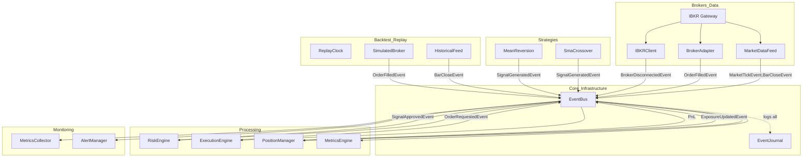
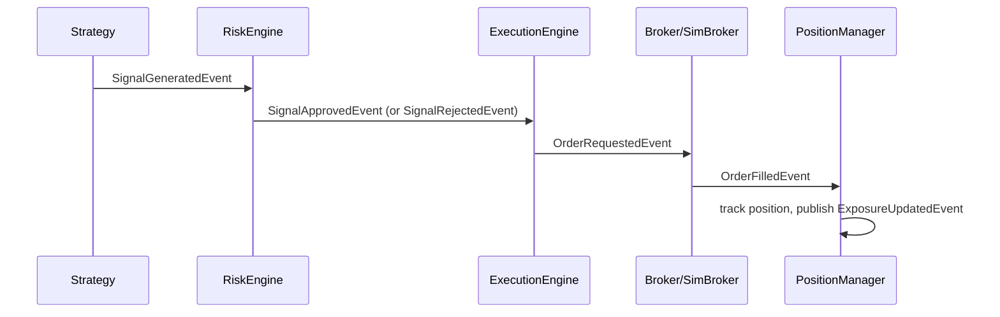

# AGENTS.md

## Commands

```sh
poetry run pytest -k "not test_stop_during_run"  # All 436 tests (excl. 1 flaky)
poetry run ruff check .                # Lint (0 errors expected)
poetry run ruff check --fix .          # Lint + fix
poetry run ruff format .               # Format (line-length 100, double quotes)
poetry run mypy src/                   # Strict typecheck (0 errors expected)
poetry run pre-commit run --all-files  # All hooks
poetry run python -m trading_platform.app.main  # Run app (needs IB Gateway)
```

Order: `ruff check -> ruff format -> mypy -> pytest`.

## Architecture Overview



## Directory Structure & Key Entry Points

```
src/trading_platform/
├── app/           # bootstrap.py (Application, lifecycle), config.py (pydantic), main.py
├── broker/        # ibkr_client.py (IBKR connection), market_data.py (ticks+bars),
│                  # order_management.py (BrokerAdapter)
├── events/        # event_types.py (27 domain events), bus.py (EventBus), journal.py
├── execution/     # engine.py (signal→order pipeline), sizing.py (SizingEngine)
├── monitoring/    # logging.py (structlog setup), metrics.py (MetricsCollector),
│                  # alerts.py (AlertManager)
├── persistence/   # database.py (SQLAlchemy engine), models.py (4 ORM models)
├── portfolio/     # position.py (PositionManager with exposure/PnL)
├── replay/        # clock.py, engine.py, historical_feed.py, simulated_broker.py,
│                  # metrics.py (BacktestMetrics)
├── risk/          # engine.py (6 risk checks + kill switch)
└── strategies/    # base.py (Strategy/StrategyLoader), examples/ (sma_crossover, mean_reversion)

tests/  # 20 test files, 436 tests, pytest-asyncio with asyncio_mode=auto
```

## Implementation Status

All 10 phases complete (P0–P10). 436 tests across 20 files (1 flaky excluded: `test_stop_during_run`).

## Architecture Principles

- **Modular monolith**, single process, single asyncio event loop
- **Events as single source of truth** — 27 frozen dataclass event types, `to_dict()`/`from_dict()` serialization
- **`EventBus`** — dual `asyncio.Queue` (high vs normal priority), typed `subscribe()`, wildcard `subscribe_all()`, predicate filters, error handlers, `drain()` for test sync
- **`EventJournal`** — SQLite append-only event store for replay/audit
- **IBKR types MUST NOT leak outside `broker/`** — `ib_insync.IB` is typed as `Any`, all cross-module communication uses domain events
- **Strategies emit signals only** — never place orders, call IBKR, or manage positions
- **Same code path for live and backtest** — only data source and clock differ
- **All components lifecycle-managed** — `start()`/`stop()` with idempotency, unsubscribe callables

## Event Flow (Signal → Fill)



## Key Config (from pyproject.toml)

| Tool | Setting |
|---|---|
| ruff | line-length 100, double quotes, lint: `E,F,I,N,W,UP,B,SIM,ARG` |
| mypy | strict mode, `disallow_untyped_defs = true`, excludes `tests/` |
| pytest | `asyncio_mode = auto`, `pythonpath = ["src"]` |
| coverage | source: `src/trading_platform` |

## Test Conventions

- Async by default (`asyncio_mode = auto`)
- Import directly from `trading_platform.*` (via `pythonpath = ["src"]`)
- After `EventBus.publish()`, call `await event_bus.drain()` before assertions
- `tmp_path` for SQLite tests, `MagicMock`/`AsyncMock` for IBKR tests
- Mock `ib` injected via constructor; never requires live TWS/Gateway
- `collected_events` fixture with `subscribe_all` + `drain()`

## Gotchas

- `ib_insync.IB` has no type stubs — `# type: ignore[no-untyped-call]` on `IB()` constructor
- SQLAlchemy column access needs `# type: ignore[assignment]` / `# type: ignore[arg-type]`
- `reconnect_interval` in `BrokerConfig` is `float` (not int)
- `.agents/summary/` contains full documentation: architecture, components, interfaces, workflows, design docs
- `data/` is empty at setup; `data/trading.db` is gitignored via `*.db` and `*.sqlite`
- `poetry.lock` IS in `.gitignore` (intentional)
- `Contract()` second arg is `sec_type` (str) but mypy sees `int` — `# type: ignore[arg-type]`
- Bar aggregation is tick-triggered: bar emitted when a tick arrives AFTER the time window
- `test_stop_during_run` in `test_replay.py` is flaky (hangs) — excluded from full runs
- `_on_filled` in `ExecutionEngine` exists but is never subscribed (dead code)
- No async DB — persistence uses sync SQLAlchemy sessions

## Custom Instructions

<!-- This section is maintained by developers and agents during day-to-day work.
     It is NOT auto-generated by codebase-summary and MUST be preserved during refreshes.
     Add project-specific conventions, gotchas, and workflow requirements here. -->
